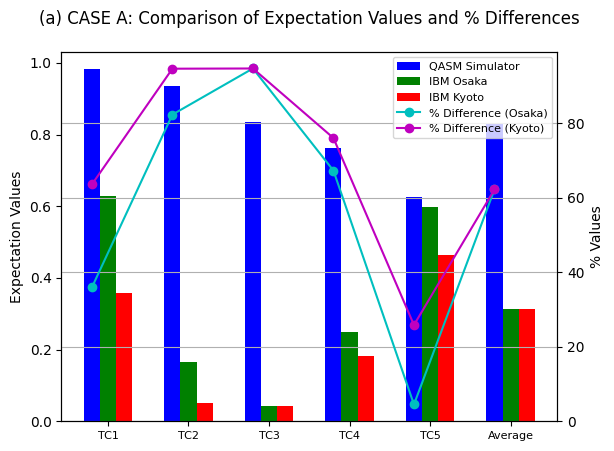
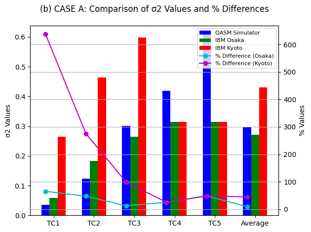
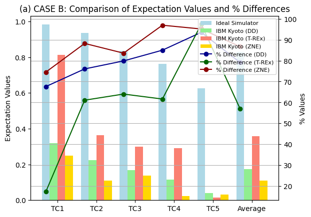
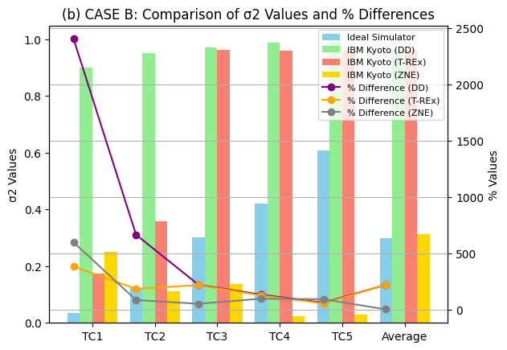
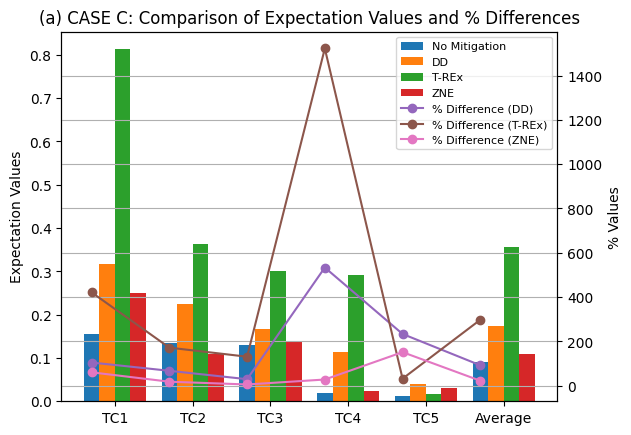
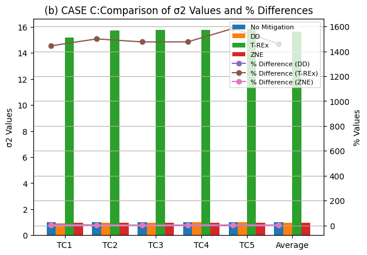
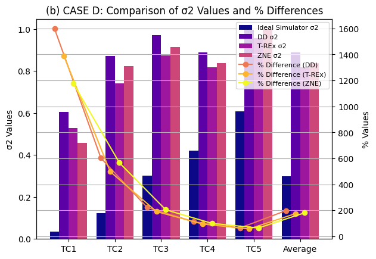
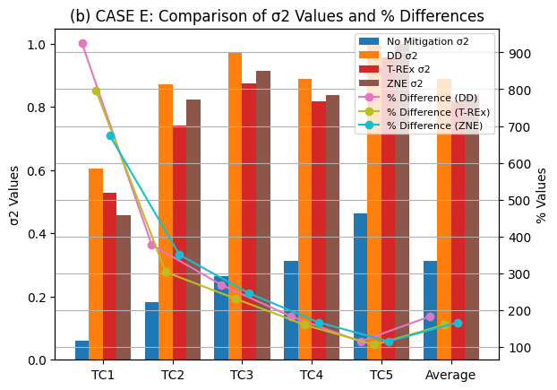

# Error Mitigation in the NISQ Era: Applying Measurement Error Mitigation Techniques to Enhance Quantum Circuit Performance

[](https://doi.org/10.3390/math12142235)
[](https://creativecommons.org/licenses/by/4.0/)

## 📄 About
This repository contains the code, data, and figures supporting the publication:  

> **M.U. Khan, M.A. Kamran, W.R. Khan, M.M. Ibrahim, M.U. Ali, S.W. Lee (2024).**  
> *Error Mitigation in the NISQ Era: Applying Measurement Error Mitigation Techniques to Enhance Quantum Circuit Performance.*  
> Mathematics, 12(14), 2235.  
> DOI: [10.3390/math12142235](https://doi.org/10.3390/math12142235)

The work explores error mitigation techniques (Dynamic Decoupling, T-REx, Zero-Noise Extrapolation) on **IBM Kyoto**, **IBM Osaka**, and **QASM simulator**, focusing on **Trotterized Quantum Circuits (QTCs)**.

---

## 📂 Repository Structure
```
Error-Mitigation-NISQ/
│── README.md                # Main documentation
│── LICENSE                  # CC BY 4.0 or MIT
│── requirements.txt         # Python dependencies
│── notebooks/               # Jupyter notebooks
│── data/                    # Calibration and raw data
│── figures/                 # Figures for results
│── paper/                   # Reference to published paper
```

---

## ⚙️ Requirements
- Python 3.9+  
- Qiskit  
- NumPy, SciPy, Matplotlib, Pandas, Seaborn  

Install dependencies:
```bash
pip install -r requirements.txt
```

---

## ▶️ Usage
1. Clone the repository:
   ```bash
   git clone https://github.com/mishaurooj/Quantum-Error-Mitigation-in-the-NISQ-Era.git
   cd Error-Mitigation-NISQ
   ```
2. Open the notebooks in `notebooks/` to reproduce the experiments.  
3. Figures will be generated in the `figures/` directory.  

---

## 📊 Results

### Case A – Expectation Values & Variances
- **CaseA-1.png**: Comparison of expectation values between QASM Simulator, IBM Osaka, and IBM Kyoto, including percentage differences.  


- **CaseA-2.png**: Comparison of variance (σ²) values between QASM Simulator, IBM Osaka, and IBM Kyoto, including percentage differences.  


### Case B – Error Mitigation with T-REx
- **CaseB-1.png**: Demonstrates improvements in expectation values after applying T-REx on IBM Kyoto and Osaka.  


- **CaseB-2.png**: Variance reductions achieved with T-REx.  


### Case C – Error Mitigation with Dynamic Decoupling
- **CaseC-1.png**: Expectation values before and after applying Dynamic Decoupling.  


- **CaseC-2.png**: Variance reductions under Dynamic Decoupling.  


### Case D – Zero-Noise Extrapolation (ZNE)
- **CaseD-1.png**: Expectation values comparison for ZNE.  


- **CaseD-2.png**: Variance analysis under ZNE.  


### Case E – Combined Error Mitigation
- **CaseE-1.png**: Final expectation values comparison using combined mitigation strategies.  


- **CaseE-2.png**: Variance comparison under combined strategies.  


---

## 📜 License
This repository follows the **Creative Commons Attribution (CC BY 4.0)** license — consistent with the MDPI publication license.

[](https://creativecommons.org/licenses/by/4.0/)

---
